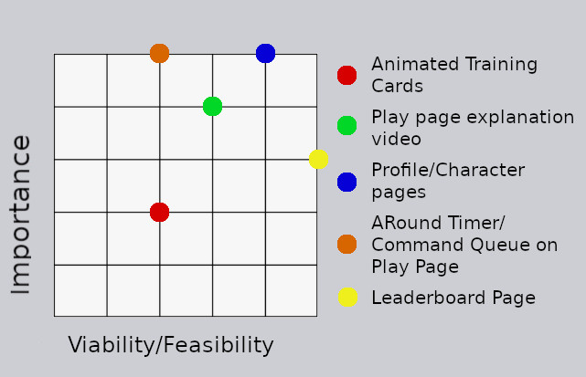
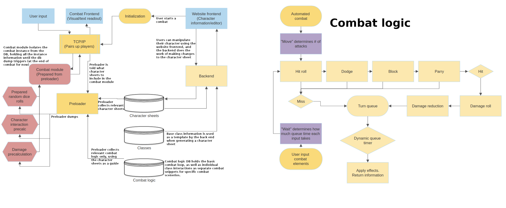
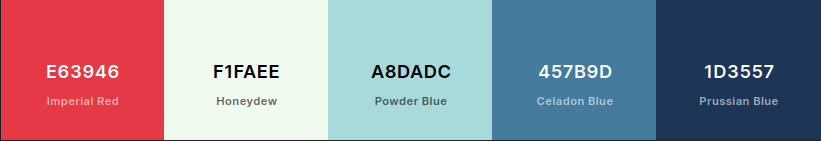
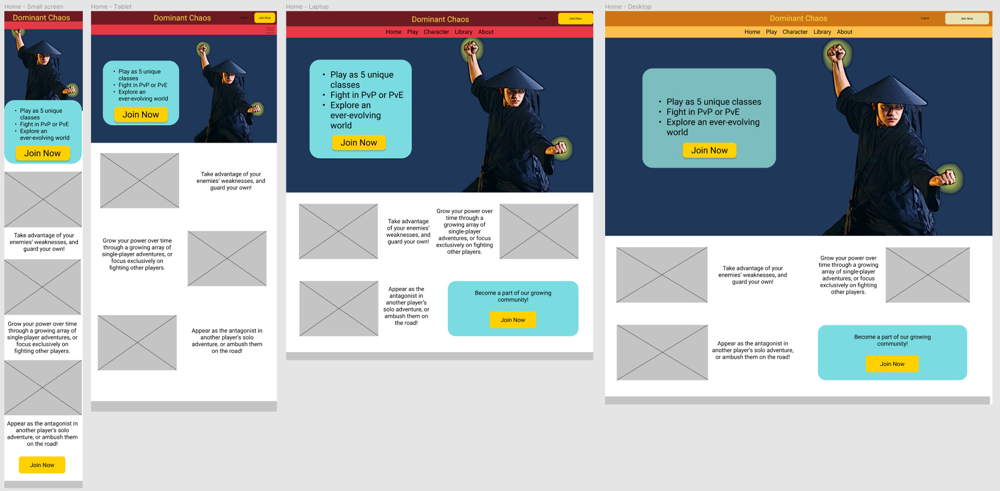
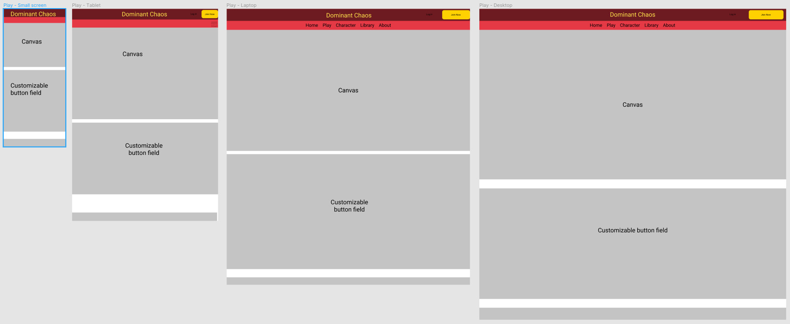
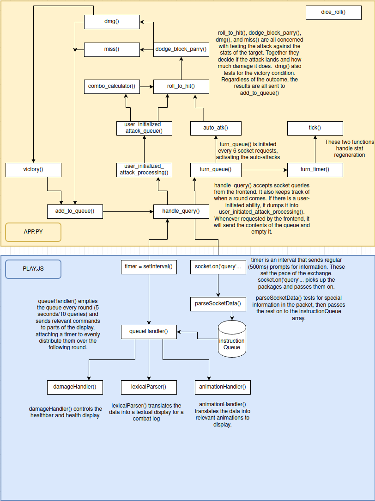
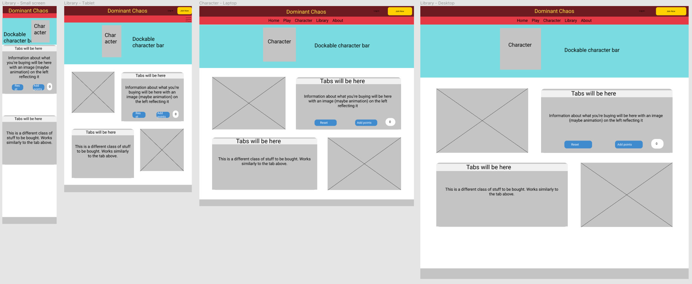

# Preface

## About the project
This project was intended to serve two purposes: To act as the basis for a personal passion project and for Milestone project 3 for Code Institute. As such, the developer tried to create a project that fulfilled two sets of requirements.

***


# Introduction
This is a game idea a friend and I have been kicking around since the end of Static Chaos. The core of the game will be the PvP element, with multiple classes (starting with 4 or 5), a turn-based combat system with 5 second ticks. Basic attacks are automated but players will be able to queue one or two more powerful abilities, stance changes and attacks every tick.

All code, art and game concepts are the sole original work of the developer, with the exception of the code and art credited at the end of this document. No tutorial was followed to make this game.

## Table of contents
***
1. [Introduction](#Introduction)
    
    i. [Project Goal](#Project-goal)

2. [Development Planes](#Development-planes)

    i. [Strategy](#Strategy)

    ii. [Scope](#Scope)

    iii. [Structure](#Structure)

    iv. [Skeleton](#Skeleton)

    v. [Surface](#Surface)

3. [Original development plan](#Original-development-plan)

    i. [Phase 1](#Phase-1)

    ii. [Phase 2](#Phase-2)

4. [Current features](#Current-features)

    i. [Features](#Features)

    iii. [Unimplemented features](#Unimplemented-features)

5. [Deployment and Testing](#Deployment-and-testing)

    i. [Testing](#testing)

    ii. [Deployment](#deployment)

6. [Known Issues](#known-issues)    
7. [Bugs](#bugs)
8. [Credits and references](#credits-and-references)

    i. [Technologies used](#Technologies-used)

    ii. [Code credits](#code-credits)

    iii. [Visuals credits](#Visuals)

    iv. [Acknowledgements](#Acknowledgements)

## Project goal
Chaos Legacy is designed to provide a fun character-building adventure with challenging fights to test their tactical thinking and character-building choices. Although finishing the adventure is outside the time-scale of this project, it should give a basic understanding of what the developer was going for.

For the developer, the project serves as a platform to learn new technologies which is why libraries like Socket.io and MaterializeCSS are being used.

***
## User Stories
As a user, I like:
1. Being challenged
2. Exploring a new game system
3. Exploring other characters
4. Having my own representation on the site
5. Having control over my data
***
# Development Planes
Development followed generally the concept of development planes. As shown below, development began in the third part: structure. From there, development worked backward, then forward.

## Strategy
The following categories of people might be interested in Chaos Legacy:
- New and returning player
- People interested in exploring a system

### Requirements
The application needs to:
- Give users the ability to modify their characters
- Give users the ability to use their characters
- Let users explore other characters
- Let users learn about the game mechanics
- Entertain!

### Strategy table


### Animated Training Cards (Not implemented)
The training cards as implemented have static images that represent each part or ability being trained, that changes dynamically. Optimally, those spaces would have had a simple two or three frame animation of a sprite that dynamically focused on each part being trained. 

- Importance: 2. This feature would certainly give a certain amount of "flavor" to the character page, drawing people into their character. However, there are a lot of other places to achieve that effect.

- Viability/Feasibility: 2. This feature would require the addition of an animated sprite, and would require the user to load the entire 7 megabyte Phaser script. It would also require the developer to figure out how to cleanly tie JavaScript from the canvas into behavior on the same page.

### Play Page Explanation Video (Implemented)
The Play page seems like a simple thing, but a great deal of work went into getting it together. Part of the purpose of this software is for evaluation, so a showcase of its inner workings would help shine a light on nearly 1200 lines of byzantine code.

- Importance: 4. 

- Viability/Feasibility: 3. The process would go: screenshot code, edit each screenshot, arrange them in a video, write a script, record the audio, synchronize screenshots to audio cues, upload to YouTube. It would take at least a day.

[Finished feature can be viewed here](https://youtu.be/aKTJmpi6k6Y)

### Profile/Character pages
These are essential elements of the site, and contain all of the CRUD parts. However, they could be compressed and simplified into buttons in a Phaser canvas. Pages would help tie the frontend to the backend better, and give the sense of a bigger site than just the game. They can also be far more easily styled and responsive.

- Importance: 5. This upgrade will make the site as a whole more fleshed-out and complete-feeling. It will also be far more responsive.

- Viability/Feasibility: 4. These pages will take a great deal of time.

### A round timer/Command Queue on Play Page (not implemented)
A round timer and command queue gives valuable feedback to the user as they are playing the game, giving meaning and sense to what are essential gameplay mechanics.

- Importance: 5. Without these, the gameplay will feel disjointed and confusing.

- Viability/Feasibility: 2. The process will go: Conceptualize a good representation of the round timer effect (probably some sort of notched ruler that moves at the pace of the rounds) and command queue (A list down the right of issued commands and a countdown to their eventual execution), create graphics for both, position them in the canvas, make them responsive, animate them. We might even have to tie the queue into the backend or risk getting faulty countdown timers. 

### Leaderboard Page (Implemented)
A leaderboard page would show who has the highest score in the game.

- Importance: 3. While this is not important, it would serve as the only connection between the player and the rest of the community with no multiplayer present.

- Viability/Feasibility: 5. This is an extremely attainable goal. Some JS and backend work will be necessary but not enough to scare us away from this feature.

[Back to top](#table-of-contents)
***
## Scope

The app should have:
- The ability to manage the user's account
- The ability to manage and modify the user's characters
- A website which helps a player learn about the game
- A clear visual style
- A complete game loop
- Choices made by the player that impact how they play the game

***
## Structure
[An early prototype version of the combat logic is available here](/assets/py/fightbase.py)

This was originally intended to be kept in a separate file from the rest of the backend app. As I wrote when I moved all of the combat logic:

    "SocketIO is functioning in app.py, but fightbase.py needs to be able to route through the socket also. I found several examples of how to make this work, but it involved a total restructure of my code and heroku configuration. It would be using blueprints and total separation of code.

    Considering that the workload of this project has ballooned way larger than I had ever expected, in the interests of time I will just be moving all of the fight logic into app.py.

    It's an uglier solution than I would like, but it makes the schedule fit better."
***

[An early mockup of what the Inward Fist class should consist of is available here](/assets/py/inwardfist.py)

Once the basic combat logic was installed, this was our primary working document for the play.js logic. Much of this was successfully implemented, however:
- The combo system is partially installed. Ki can be gained to the points and the combo executed, but the actual commands in the backend are incomplete. The structure for coding each of the combo commands is in place, but the workload of finishing and polishing all of it was frankly enormous, especially considering that due to the planned length of some of the combo strikes and additional necessary animations.

- Ki is intended to start at zero and be trained from the character screen. It is still automatically at maximum for new players.

- "Tiers of aura" are a glow that should form around the character at 10, 20 and 25 ki. The animations are in the game, but play.js coding was halted before they were implemented.

- None of the disciplines do anything.

- Spritesheet 2 was never completed, but their components weren't implemented either. Most of them are related to the unimplemented combos.
***



### Play page and backend
The image above shows the bare minimum to build the game loop (apart from the elements in pink in the image above)
All core gameplay calculations are isolated from the frontend per model-view-controller theory. This way, a clever user could never modify their in-game performance. All important calculations are done exclusively in the backend and the results passed to the front.

It will require:
- Socket communication with the backend
- Extensive combat logic
- A way to parallelize the flow on the back and frontend. 


A simplified version of how the character is generated and then used to build the character that is used in play.js.

[Back to top](#table-of-contents)
***
# Surface
## The front end


### Front page:
Typical splash page. 
- Header, navbar
- hero image with small blurb and "start playing".
- Scroll down for a more elaborated version of the small blurb in the hero


***
### Play page
- Canvas with whatever graphics I can scrounge. 
- Mutable control scheme below.





***
### Character page
- Contains all training and upgrades for the character
- Contains all control scheme customization
- Maybe has a small canvas that shows the character and highlights parts when hovering over elements



### About page
- Info about the game and the developer

### Library page
- Contains learning materials pertinent to playing the game, and maybe information about coming updates and additions.

[Back to top](#table-of-contents)
***
# Current Features
The actual development of the game went roughly according to the plans outlined above. I will go through the plan above and show how each part was implemented, and document the deviations. Note that these features are delved into in much more detail in the testing documentation.
***
## Features implemented
### Front end
***
### Index page (Home)
[Live version](http://dominant-chaos.herokuapp.com/index)

The splash page is a relatively simple layout and was implemented essentially exactly as planned.

### Leaderboard (Unplanned feature)
[Live Version](http://dominant-chaos.herokuapp.com/leaderboard)

The leaderboard was not initially planned but made too much sense to omit.

It contains a list version of the 10 most progressed characters in the database, sorted by experience spent. If the user has characters that are not included in the top 10, their characters are displayed in a separate list below, with their relative position.

### Library
[Live Version](http://dominant-chaos.herokuapp.com/library/general)

The library was implemented essentially exactly as planned, except the pagination is handled by Jinja instead of JavaScript. Each page is a separate html fragment nested in base.html > library.html > (subject).html

### Play
1. [Live Version](http://dominant-chaos.herokuapp.com/play)

2. [Play.js](https://github.com/JDygard/dominant_chaos/blob/main/static/js/play.js): While not the only script relevant to the play page, it is the most important and most verbose.

3. [Preloader.js](https://github.com/JDygard/dominant_chaos/blob/main/static/js/preloader.js): Preloads assets for the engine

4. [Loader.js](https://github.com/JDygard/dominant_chaos/blob/main/static/js/loader.js): Loads and launches the Phaser engine

5. [char-select.js](https://github.com/JDygard/dominant_chaos/blob/main/static/js/char-select.js): Screen that lets a user choose their character.

`A note to assessors:` The play canvas is not polished. A list of missing features to make it a passably complete product is discussed in the [backend section](#back-end).

The page has a link to an explanation video located on the About page. It delves into the vagueries of the relationship between [app.py](https://github.com/JDygard/dominant_chaos/blob/main/app.py) and [Play.js](https://github.com/JDygard/dominant_chaos/blob/main/static/js/play.js).

It also contains a Phaser canvas object that displays the main gameplay component of the site. If you are interested in learning more about the mechanics of the canvas, see the aforementioned [explanation video.](http://dominant-chaos.herokuapp.com/about)

[Back to top](#table-of-contents)

### Profile
[Live Version](http://dominant-chaos.herokuapp.com/profile/profile) NOTE: You must be logged in to this account:

    accountname: profile
    password: profile

### Character

[Live Version](http://dominant-chaos.herokuapp.com/character/character) NOTE: You must be logged in to this account to see the full version of the character page:

    accountname: profile
    password: profile


[character.js](https://github.com/JDygard/dominant_chaos/blob/main/static/js/character.js): the javascript for the version of the character page where the user is not logged in.

- lines 1-30: numberShortener(). This abbreviates numbers longer than 3 digits into a shorthand, i.e. 123,456,789 is shortened to 123.4m, 1,234 is shortened to 1.2k.
- lines 32-35: Collects the character bio and displays it. Otherwise, it is filled automatically with placeholder text.
- lines 38-39: Applies the numberShortener() function to appropriate fields.

[character-user.js](https://github.com/JDygard/dominant_chaos/blob/main/static/js/character-user.js): Javascript for logged-in users.

- lines 1-49: Calculating and displaying costs: This is built around two functions: the first does the simple job of displaying the appropriate cost of Discipline, and the other calculates and displays the cost of one more point, the cost of current selected points, and how many points are already trained for bodytraining.

- lines 55-81: moveActive(): Controls pagination for training cards.

- lines 86-126: defines the socket.io data to live update the character icon without reloading, and displays the list of options in the dropdown menu.

- lines 128-151: Concerns the delete character dropdown and buttons.

- lines 154-166: has to do with flipping the divs for consistent stacking on smaller screens

### About
[Live Version](http://dominant-chaos.herokuapp.com/about)

### Back end
[app.py](https://github.com/JDygard/dominant_chaos/blob/main/app.py)

The backend could have been split between multiple files using blueprinting to increase readability and accessibility for coding. However, since the Socket system was built into the app file, and everything accessing it was also there, it would be difficult to move it all into other files without completely rewriting huge sections of the site. The current implementation is less navigable and more cumbersome to work with.


#### 1-37: Boilerplate imports and app.config declarations

#### 40-358: Fight logic
This contains the 14 functions that comprise the "Combat Logic" square in the documentation above.
While this piece of code is incomplete, it is robust and much of the code is reusable. Features other than gameplay:

- Semi-uniform and extensible gameplay code practices: The code calculating hits and damage is uniform and built to accept new character types with little or no changes to existing code.

- Code division: Following MVC design patterning, the frontend has zero control over what happens in the backend. 

Unimplemented features: 

- Combos: Unfinished. Lines 87-146 give a clue as to what was planned here. They were being designed to populate the queue with multiple custom attacks that would trigger special animations and messages on the frontend. This was cut short due to time.

- A round timer: This was intended to be a heartbeat or moving ruler sort of animation that tied to round duration. It would help give the user a sense of what is going on behind the scenes.

- A queued move list: This was intended to be a list with timers along the right side of the screen. Because commands issued to the game are not executed immediately, some sort of feedback should be given to the user that helps them understand what's happening with the delay. This was cut because of the necessity to coordinate with the backend to avoid bad interactions. 

- Reset the round without reloading: This, unfortunately, was cut due to time. Because of how the front and backend work together, it would take a while to code coordination for a full reset.

-  One upgrade considered was that each character would generate a class() populated with methods to insert into the fight code instead of cluttering 

- More characters

- Varied and scaling encounters and environments

#### 364-523: Socket listeners
These lines contain the socket.io related code. Any signal from play.js is recieved and interpreted here.

#### 532-828: Routes
These lines contain the routes for the HTML pages and some functions for dealing with those routes.

[Back to top](#table-of-contents)
***
# Deployment
## Testing
Testing data can be found in a separate [testing file](TESTING.md).

[Back to top](#table-of-contents)
***
## Database
This software uses a non-relational database cluster on [MongoDB](https://www.mongodb.com/)
1. Log into or create an account on [MongoDB](https://www.mongodb.com/)
2. Find and select `New Project`, and name your project.
3. Navigate to the "Project" page.
4. Find and select `Create a New Cluster`
    - Choose a cluster (Shared is free)
    - Select an appropriate provider, region, cluster tier and cluster name
5. Select `Database Access` and click `Add new database user`
    - Password authentication
    - Setup a username and password
    - Add user
6. `Network access` > `Database access` > `Add IP address`
    - `Allow access from anywhere`
    - `Confirm`
7. Click `Clusters` after it loads.
8. `Collections` > `Create Database`
    - Enter an appropriate database name, collection name and click `Create`
9. Click `Create collection` and create a "users" and a "characters" collection.

[Back to top](#table-of-contents)
***
## Local Clone
### Deployment
This project was developed using Visual Studio Code v1.55.0, and all commit/push commands were performed in the software's terminal.

#### Github Pages
1. Log into GitHub
2. Navigate to [the repository](https://github.com/JDygard/dominant-chaos).
3. Click "Settings"
4. Scroll to "GitHub Pages"
5. Select a branch.
6. The "GitHub Pages" section should now contain the link to the deployed page.

#### Creating a fork
1. Navigate to [the repository](https://github.com/JDygard/dominant_chaos).
2. Click "Fork"

#### Cloning with GitPod
1. Install GitPod extension.
2. Log into GitHub
3. Navigate to [the repository](https://github.com/JDygard/dominant_chaos).
4. Click "GitPod."
 
#### Cloning into VSCode
1. Navigate to [the repository](https://github.com/JDygard/dominant_chaos).
2. Click "Clone or download"
3. Copy the provided URL.
4. Open your terminal
5. Navigate to the desired target directory
6. type 'git clone' and then paste the url.

#### Environment Variables
1. Create .gitignore in the project's root directory.
2. Create env.py in the project's root directory.
3. Add env.py to .gitignore.
4. env.py should contain the following, replacing the the items in <> with your own data:

    ```
    import os

    os.environ.setdefault("IP", "0.0.0.0")
    os.environ.setdefault("PORT", "5000")
    os.environ.setdefault("SECRET_KEY", "<your secret key>")
    os.environ.setdefault("MONGO_URI", "mongodb+srv://<username>:<password>@mongodbpg.eqmx3.mongodb.net/<database name>?retryWrites=true&w=majority")
    os.environ.setdefault("MONGO_DBNAME", "<your DB name>")
    os.environ.setdefault("SECURITY_PASSWORD_SALT", "<your password salt>")
    ```

## Heroku Deployment
1. Create `requirements.txt` in the root directory.
2. Run ``` pip3 install -r requirements.txt ``` in your bash
3. Create `Procfile` in your base directory.
4. Run ```echo web: python app.py > Procfile```
5. Add all files to your repository and push to GitHub.
6. Log in or create an account on [Heroku](https://www.heroku.com/)
7. Create a new app, and give it an appropriate name.
8. `Deploy` the app and choose `Connect to Github`
9. Select your repository from GitHub and click Connect
10. Click the `Settings` tab and select `Reveal Config Vars`
11. This is where the secret variables from your `env.py` will be stored. Enter them here.
12. Click the `Deploy` tab and navigate to the bottom, to click `Automatic Deploys`
13. `View app` is in the top-right and will take you to your deployed version of this app.

[Back to top](#table-of-contents)
***
# Known Issues
## Profile page inaccessible to logged-out users
It was decided that there isn't a lot of relevant or interesting data to be gleaned from the user page for other users. As such, no special effort was put into making them accessible.

## Key errors
There should be try/except blocks to account for key errors and avoid the crash screen. However, the developer had time management issues and this feature fell to the wayside.

## Play Page not polished
This was a time management issue more than anything else. Other parts of the README go into this in more detail.

[Back to top](#table-of-contents)
***
# Bugs
Unfortunately the developer did not keep very good track of the serious bugs found while making this project, or their potential solutions. Current bugs are listed above in "Known issues" or covered in the [testing file](TESTING.md).

[Back to top](#table-of-contents)
***
# Lessons learned
## Otherwise known as "Flaws in our plan"
***
### Uniform JSON data
The whole system is built around modular functions that work dynamically with other functions so that the system can be built on infinitely. In the end, some of these functions needed complex information parsing in order to work properly. It would have been a great idea to make all data passed around in the backend one uniform package. It would mean information being passed into functions that didn't need it, but it would also mean that no parsing would be needed between multiple functions in the backend.

***
### Bootstrap is awesome
In order to test the waters of other technology, and because Code Institute used it in one of its write-along lessons, the developer chose to use MaterializeCSS for the frontend.

Materialize results in stale layouts that are difficult to manipulate for complex pages. If a developer intends to go "off-book" for anything, the amount of CSS written while wrestling against Materialize is shocking.

[Back to top](#table-of-contents)
***
### 

# Credits and References
## Technologies used
1. [Phaser 3](https://photonstorm.github.io/phaser3-docs/index.html): Phaser 3 and the API documentation were used in making the Play page.
2. [Javascript](https://en.wikipedia.org/wiki/JavaScript): Javascript is active on most frontend pages.
3. [Python 3.8](https://www.python.org/): Used to build the backend in Flask
4. [GNU Image Manipulation Program (GIMP)](https://www.gimp.org/): Used extensively making animations and sprites
5. [CSS](https://en.wikipedia.org/wiki/CSS)
6. [HTML5](https://en.wikipedia.org/wiki/HTML5)
7. [Google Fonts](https://fonts.google.com/)

[Back to top](#table-of-contents)
## Code Credits

[W3 School's Tooltips](https://www.w3schools.com/css/css_tooltip.asp)

Used in the character page to show details of items on mouseover.

***

[Stackoverflow answer on number in circle](https://stackoverflow.com/questions/4861224/how-to-use-css-to-surround-a-number-with-a-circle/19613616)

Adapted for use in displaying stat blocks on the character page.

***

[Flask-socket.io documentation](https://flask-socketio.readthedocs.io/en/latest/getting_started.html)

Adapted and used extensively in all of the socket manipulation

[Back to top](#table-of-contents)
***

## Visuals
[Man Doing Pushups](https://www.pexels.com/photo/man-doing-push-ups-4162495/) by [Ivan Samkov](https://www.pexels.com/@ivan-samkov)

[Man Doing Yoga](https://www.pexels.com/photo/man-doing-yoga-2294363/) by [Li Sun](https://www.pexels.com/@823sl)

[Man People Sport Hurry](https://www.pexels.com/photo/man-people-sport-hurry-5961753/) by [Run FFWPU](https://www.pexels.com/@runffwpu)

[Man Throwing Punches on the Punching Bag](https://www.pexels.com/photo/man-throwing-punches-on-the-punching-bag-7187935/) by [Rodnae Prod](https://www.pexels.com/@rodnae-prod)

[Woman In Red Robe Standing Near A Body of Water](https://www.pexels.com/photo/woman-in-red-robe-standing-near-body-of-water-5386375/) by [CottonBro](https://www.pexels.com/@cottonbro)

[Close Up Photo of Person's Eye](https://www.pexels.com/photo/close-up-photo-of-person-s-eye-2168356/) by [Mark Aaron Smith](https://www.pexels.com/@markarronsmith)

[A Man Kicking on the Water](https://www.pexels.com/photo/a-man-kicking-on-the-water-5895883/) by [Anna Terezevich](https://www.pexels.com/@anntarazevich)

[Silhouette of Man Practicing Kickboxing on the Seashore During Sunset](https://www.pexels.com/photo/silhouette-of-man-practicing-kickboxing-on-the-seashore-during-sunset-5895869/) by [Anna Terezevich](https://www.pexels.com/@anntarazevich)

[Yellow and White Smoke During Nighttime](https://www.pexels.com/photo/yellow-and-white-smoke-during-night-time-5109305/) by [Rotislav Uzunov](https://www.pexels.com/@rostislav-uzunov-3145660)

[Left Fist](https://www.pexels.com/photo/left-fist-635356/) by [Neo8iam](https://www.pexels.com/@neo8iam)

[Man in Sleeveless Wetsuit Doing Some Aerobics at the Beach](https://www.pexels.com/photo/man-in-sleeveless-wet-suit-doing-some-aerobics-at-the-beach-617000/) by [Artem Beliaikin](https://www.pexels.com/@belart84)

[Light City Fashion Man](https://www.pexels.com/photo/light-city-fashion-man-7792245/) by [CottonBro](https://www.pexels.com/@cottonbro)

[Healthy Man Person People](https://www.pexels.com/photo/healthy-man-person-people-6253310/) by [Artem Podrez](https://www.pexels.com/@artempodrez)

[Human Fist](https://www.pexels.com/photo/human-fist-163431/) by [PixaBay](https://www.pexels.com/@pixabay)

[Man Jumping on Mid-Air](https://www.pexels.com/photo/man-jumping-on-mid-air-1701211/) by [Yogendra Singh](https://www.pexels.com/@yogendras31)

[Back to top](#table-of-contents)
***
## Acknowledgements
1. My family and friends for tolerating being shown multiple iterations of this software
2. Seun Owanikoko and Code Institute for the instruction and advice necessary to complete this.

[Back to top](#table-of-contents)